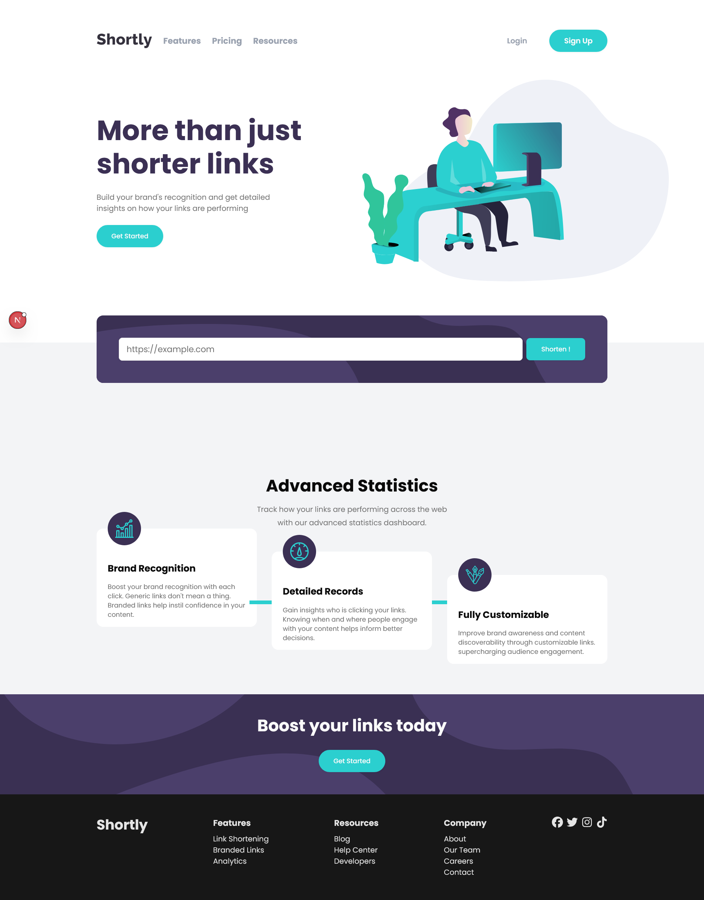

# Frontend Mentor - Shortly URL shortening API Challenge solution

This is a solution to the [Shortly URL shortening API Challenge challenge on Frontend Mentor](https://www.frontendmentor.io/challenges/url-shortening-api-landing-page-2ce3ob-G). Frontend Mentor challenges help you improve your coding skills by building realistic projects.

## Table of contents

- [Overview](#overview)
  - [The challenge](#the-challenge)
  - [Screenshot](#screenshot)
  - [Links](#links)
- [My process](#my-process)
  - [Built with](#built-with)
  - [What I learned](#what-i-learned)
  - [Continued development](#continued-development)
  - [Useful resources](#useful-resources)
- [Author](#author)
- [Acknowledgments](#acknowledgments)

**Note: Delete this note and update the table of contents based on what sections you keep.**

## Overview

### The challenge

Users should be able to:

- View the optimal layout for the site depending on their device's screen size
- Shorten any valid URL
- See a list of their shortened links, even after refreshing the browser
- Copy the shortened link to their clipboard in a single click
- Receive an error message when the `form` is submitted if:
  - The `input` field is empty

### Screenshot



### Links

- Solution URL: [Github](https://github.com/abdallemad/Shorten-url-animated-landing-page)
- Live Site URL: [Vercel](https://shorten-url-animated-landing-page.vercel.app/)

## My process

1. Setup the project with next.js and install the dependancy
2. set the folder structure for the components and sections
3. start by customize the colors and fonts
4. use mobile first metodoligy
5. use react query and axios for handling api
6. finish the design and add animation with framer motion

### Built with

- [Next.js](https://nextjs.org/) - React framework
- [React](https://reactjs.org/) - JS library
- [Shadcn ui](https://ui.shadcn.com/) - For styles
- [React query](https://tanstack.com/query/latest) - For handling API
- [Axios](https://www.npmjs.com/package/axios) - For Call the api
- [Framer motion](https://motion.dev/) - For animate the hole page

### What I learned

Learned how to use react hock forms with shadcn

```jsx
const schema = z.object({
  url: z.string().url(),
});
const requestSchema = z.object({
  result_url: z.string(),
});

export function useUrlShortFrom(
  setShortUrls: Dispatch<
    SetStateAction<
      {
        url: string,
        shortUrl: string,
      }[]
    >
  >
) {
  const form = useForm({
    resolver: zodResolver(schema),
    defaultValues: {
      url: "",
    },
  });
  const isDesktop = useMediaQuery({ query: "(min-width: 768px)" });
  const { mutate, isPending } = useMutation({
    mutationFn: async (data: z.infer<typeof schema>) => {
      const response = await axios.post("/api/url", data);
      const result = requestSchema.parse(response.data);
      return result;
    },
    onSuccess: (data) => {
      const url = form.getValues("url");
      const shortUrl = data.result_url;
      setShortUrls((prev) => [...prev, { url, shortUrl }]);
      form.reset();
    },
  });
  const formRef = useRef < HTMLFormElement > null;
  const isInView = useInView(formRef, {
    once: true,
    amount: 1,
  });
  const onSubmit = (data: z.infer<typeof schema>) => mutate(data);

  return {
    form,
    onSubmit,
    isPending,
    isDesktop,
    formRef,
    isInView,
  };
}
```

learned how to use magic ui to add animation to the list of urls

```jsx
import { AnimatedList } from "@/components/magicui/animated-list";

function ShortenUrlsContainer({
  shortUrls,
}: {
  shortUrls: { url: string, shortUrl: string }[],
}) {
  return (
    <AnimatedList>
      {shortUrls.map((url, index) => (
        <ShortUrlItem key={index} url={url.url} shortUrl={url.shortUrl} />
      ))}
    </AnimatedList>
  );
}
```

### Useful resources

- [Example resource 1](https://www.example.com) - This helped me for XYZ reason. I really liked this pattern and will use it going forward.
- [Example resource 2](https://www.example.com) - This is an amazing article which helped me finally understand XYZ. I'd recommend it to anyone still learning this concept.

## Author

- Website - [Abdellah Elmadani](https://abdallahemad.vercel.app)
- Frontend Mentor - [@abdallemad](https://www.frontendmentor.io/profile/abdallemad)
- GitHub - [@abdallemad](https://github.com/abdallemad)

## Acknowledgments

This is where you can give a hat tip to anyone who helped you out on this project. Perhaps you worked in a team or got some inspiration from someone else's solution. This is the perfect place to give them some credit.
